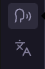
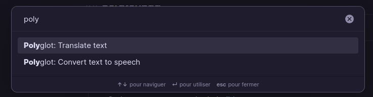
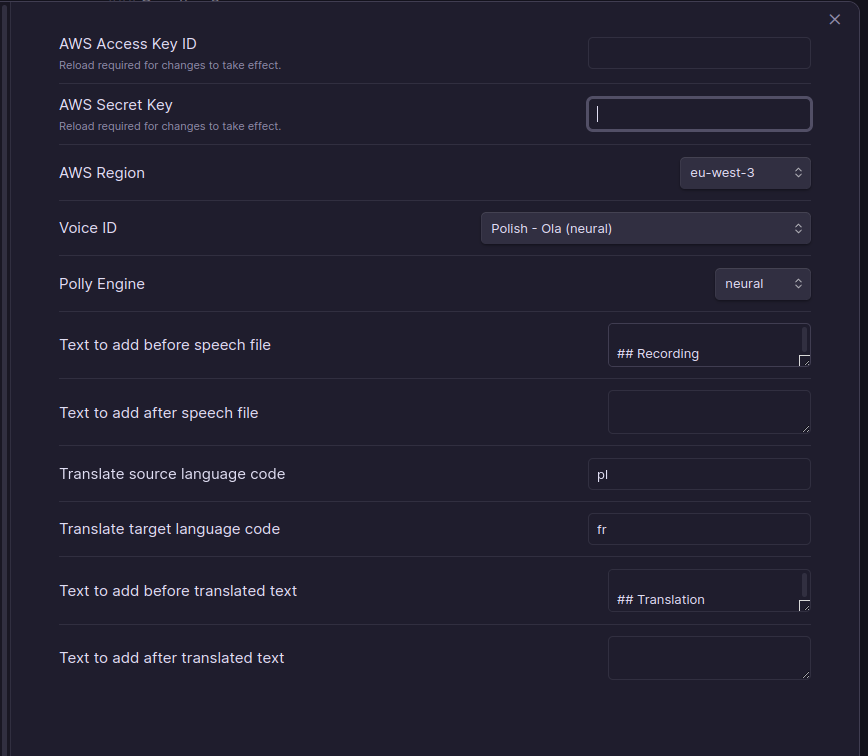
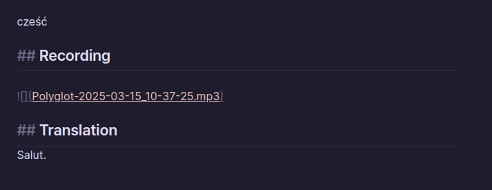
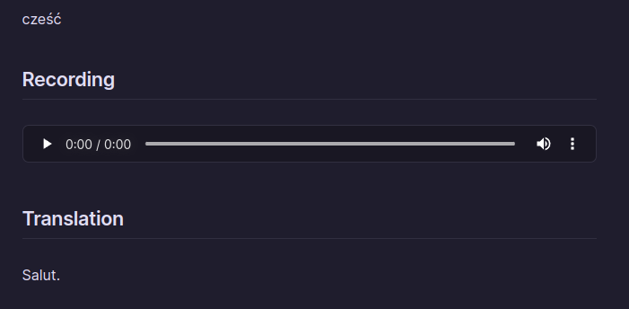

# Obsidian Polyglot

**Obsidian Polyglot** is a plugin that enables translation and text-to-speech conversion within Obsidian.

- 🌍 **Instant Translation**: Translate selected text in one click using **AWS Translate**
- 🔊 **Text-to-Speech Conversion**: Convert selected text into a local audio file using **AWS Polly**

## 🚀 Installation

1. **Clone the repository** into your Obsidian plugins folder: `.obsidian/plugins`
2. **Build the plugin**: `npm run build`
3. **Enable the plugin** in Obsidian settings.

Once activated, two icons will be added to the ribbon sidebar:

Additionally, two new commands will be available:

## ⚙️ Configuration

Before using the plugin, configure your **AWS credentials** and **preferred languages** in the settings panel:

## 🌐 Translate Text

1. **Select the text** you want to translate.
2. Click the **"Polyglot Translate"** icon in the ribbon.
3. The translated text will appear directly after your selection.

You can customize the translation output (e.g., append/prepend text) in the settings.

## 🔊 Convert Text to Speech

1. **Select the text** you want to convert to speech.
2. Click the **"Polyglot Speech"** icon in the ribbon.
3. The generated audio file will be added right after your selected text.

📌 **Offline Support**: The audio file is stored locally, meaning no internet connection is required to play it.

## 📌 Example Usage

Here’s an example of the Polish word **"cześć"** translated to **"salut"** in French:

